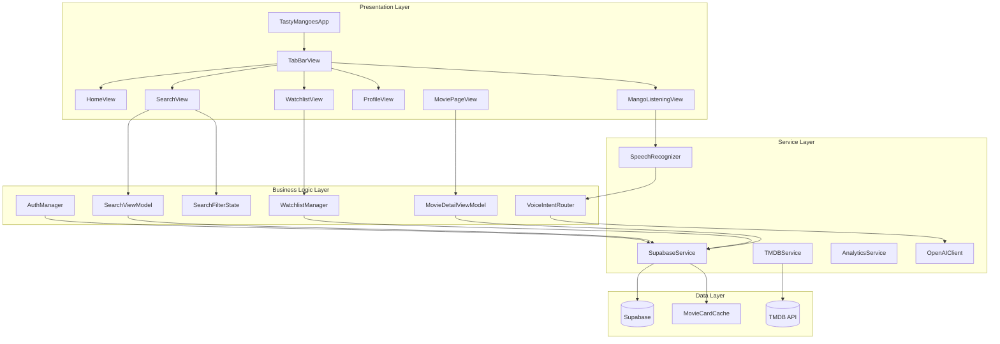
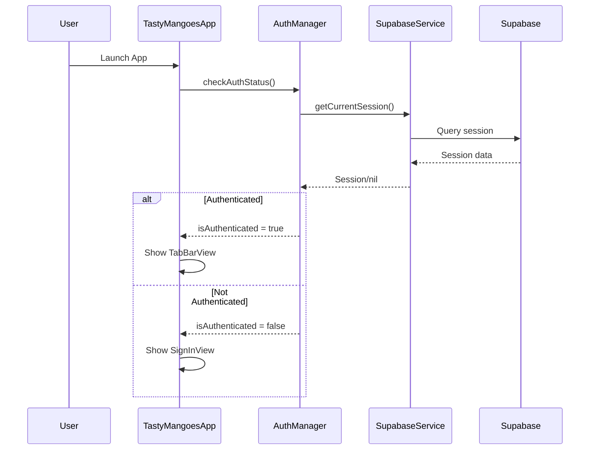
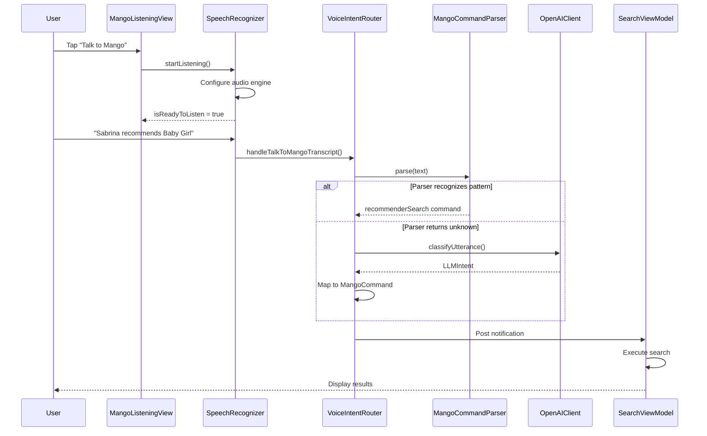
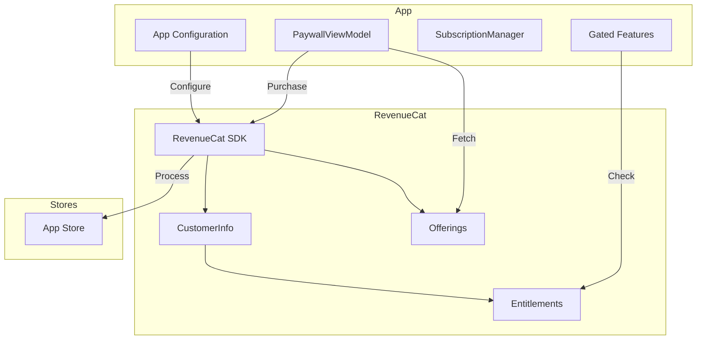
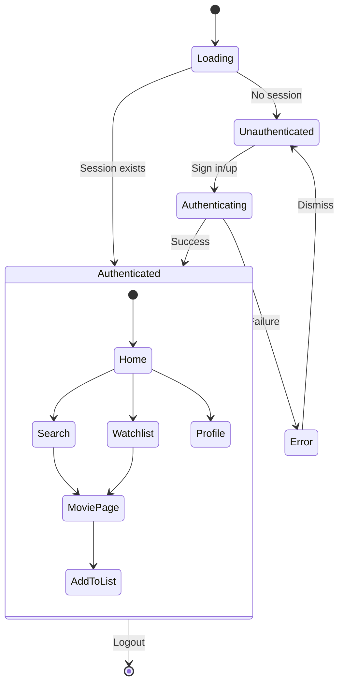

# TastyMangoes — Complete Codebase Analysis & Improvement Blueprint

> **Generated:** December 27, 2025
> **Platform:** Swift/SwiftUI (iOS 16+)
> **Health Score:** 72/100
> **Audit Duration:** Comprehensive analysis completed

---

## Executive Summary

TastyMangoes is a **movie discovery and watchlist management iOS app** with voice search capabilities powered by OpenAI. The app enables users to search for movies, create watchlists, and use voice commands to interact with the app through a mascot called "Mango."

### Overall Health Assessment
The codebase demonstrates solid foundational architecture with a clean separation of concerns. The app uses modern SwiftUI patterns with MVVM architecture, Supabase for backend services, and a sophisticated voice command system. However, there are several areas requiring attention:

**Strengths:**
- Well-organized file structure with clear naming conventions
- Comprehensive Supabase integration with edge functions
- Sophisticated voice command parsing with LLM fallback
- Good use of async/await patterns throughout
- Clean model separation (MovieCard, Movie, MovieDetail)

**Critical Issues Requiring Immediate Attention:**
1. **Security Risk:** Supabase anon key exposed in source code (`SupabaseConfig.swift:10`)
2. **Invalid Deployment Target:** iOS 26.0 (non-existent) in project.pbxproj
3. **Missing RevenueCat Integration:** No monetization infrastructure present
4. **Outdated Swift Patterns:** Using `@StateObject`/`@ObservableObject` instead of `@Observable` macro
5. **Home View Placeholder:** HomeView is essentially empty with just welcome text

**UI/UX Quality Rating:** 7/10
- Clean design language with custom fonts (Nunito, Inter)
- Good use of bottom sheets and navigation
- Missing animations and micro-interactions
- Voice UI (MangoListeningView) needs polish

**Top 3 Priorities for This Sprint:**
1. Fix security vulnerabilities (move secrets to environment/Keychain)
2. Fix deployment target to valid iOS version (17.0 or 18.0)
3. Implement RevenueCat for subscription handling

---

## Project Structure Analysis

### Current File Tree
```
TastyMangoes/
├── TastyMangoesApp.swift          # App entry point
├── TabBarView.swift               # Custom tab navigation
├── HomeVew.swift                  # Home screen (placeholder)
├── SearchView.swift               # Movie search
├── SearchViewModel.swift          # Search business logic
├── SearchFilterState.swift        # Filter state management
├── WatchlistView.swift            # Watchlist display
├── WatchlistManager.swift         # Watchlist state
├── MoviePageView.swift            # Movie detail page
├── MovieDetailView.swift          # Detailed movie view
├── MovieDetailViewModel.swift     # Movie detail logic
├── ProfileView.swift              # User profile
├── SignInView.swift               # Authentication
├── SignUpView.swift               # Registration
│
├── Models/
│   ├── Movie.swift                # Core movie model
│   ├── MovieCard.swift            # Pre-built movie card
│   ├── MovieDetail.swift          # Detailed movie info
│   ├── SupabaseModels.swift       # Database models
│
├── Services/
│   ├── AuthManager.swift          # Auth handling
│   ├── SupabaseService.swift      # Supabase client
│   ├── SupabaseConfig.swift       # Config (SECRET EXPOSED!)
│   ├── TMDBService.swift          # TMDB API
│   ├── AnalyticsService.swift     # Analytics
│   ├── MovieDetailService.swift   # Movie details
│   ├── MovieCardCache.swift       # Caching layer
│
├── Voice/
│   ├── VoiceIntentRouter.swift    # Voice command routing
│   ├── SpeechRecognizer.swift     # Speech-to-text
│   ├── MangoCommand.swift         # Command parsing
│   ├── MangoListeningView.swift   # Voice UI
│   ├── MangoSpeaker.swift         # Text-to-speech
│   ├── OpenAIClient.swift         # LLM fallback
│   ├── SelfHealingVoiceService.swift # Error recovery
│   ├── VoiceAnalyticsLogger.swift # Voice analytics
│
├── Components/
│   ├── TMIcons.swift              # Icon system (90+ icons)
│   ├── CustomIcons.swift          # Custom icon components
│   ├── PosterCarouselView.swift   # Image carousel
│   ├── ListeningIndicator.swift   # Voice status
│   ├── YouTubePlayerView.swift    # Video player
│   ├── MoviePosterImage.swift     # Poster component
│
├── Bottom Sheets/
│   ├── SearchFiltersBottomSheet.swift
│   ├── SearchGenresBottomSheet.swift
│   ├── SearchPlatformsBottomSheet.swift
│   ├── WatchlistBottomSheet.swift
│   ├── CreateWatchlistBottomSheet.swift
│   ├── EditListBottomSheet.swift
│   ├── DeleteListBottomSheet.swift
│   ├── RateBottomSheet.swift
│   ├── SortByBottomSheet.swift
│   └── PlatformBottomSheet.swift
│
├── supabase/
│   └── functions/
│       ├── search-movies/index.ts
│       ├── get-movie-card/index.ts
│       ├── ingest-movie/index.ts
│       ├── batch-ingest/index.ts
│       ├── get-similar-movies/index.ts
│       ├── log-voice-event/index.ts
│       └── _shared/tmdb.ts
│
├── src/                           # Web dashboard (React)
│   ├── app/page.tsx
│   └── components/
│       ├── DataTable.tsx
│       └── columns/voiceEventsColumns.tsx
│
└── Assets.xcassets/               # App icons & images
```

### Architecture Diagram



### Data Flow Diagram



### Voice Command Flow



---

## Critical Issues (P0 — Fix Immediately)

### Issue 1: Hardcoded API Keys in Source Code
**Files Affected:** `SupabaseConfig.swift:9-10`
**Impact:** Security vulnerability - keys exposed in version control
**Root Cause:** Direct hardcoding of secrets instead of using environment variables

**Before:**
```swift
struct SupabaseConfig {
    static let supabaseURL = "https://zyywpjddzvkqvjosifiy.supabase.co"
    static let supabaseAnonKey = "eyJhbGciOiJIUzI1NiIsInR5cCI6IkpXVCJ9..."
    // EXPOSED KEY!
}
```

**After:**
```swift
import Foundation

struct SupabaseConfig {
    static var supabaseURL: String {
        guard let url = Bundle.main.infoDictionary?["SUPABASE_URL"] as? String,
              !url.isEmpty else {
            fatalError("SUPABASE_URL not configured in Info.plist")
        }
        return url
    }

    static var supabaseAnonKey: String {
        guard let key = Bundle.main.infoDictionary?["SUPABASE_ANON_KEY"] as? String,
              !key.isEmpty else {
            fatalError("SUPABASE_ANON_KEY not configured in Info.plist")
        }
        return key
    }

    // Or use Keychain for production:
    static var supabaseAnonKeySecure: String {
        // Fetch from Keychain on first launch
        // Store securely during onboarding
        KeychainHelper.shared.read(key: "supabase_anon_key") ?? ""
    }
}
```

**Resources:**
- [Apple Keychain Services](https://developer.apple.com/documentation/security/keychain_services)
- [Supabase iOS Security Best Practices](https://supabase.com/docs/guides/getting-started/tutorials/with-swift)

---

### Issue 2: Invalid iOS Deployment Target
**Files Affected:** `TastyMangoes.xcodeproj/project.pbxproj`
**Impact:** Build will fail - iOS 26.0 does not exist
**Root Cause:** Likely typo or incorrect configuration

**Before:**
```
IPHONEOS_DEPLOYMENT_TARGET = 26.0;
```

**After:**
```
IPHONEOS_DEPLOYMENT_TARGET = 17.0;
```

---

### Issue 3: OpenAI API Key Exposure Risk
**Files Affected:** `OpenAIConfig.swift`
**Impact:** Potential API key exposure
**Root Cause:** Similar to Supabase config

**Recommendation:** Move to Info.plist with `.xcconfig` files or Keychain.

---

## High Priority Issues (P1 — Fix This Sprint)

### Issue 4: Outdated SwiftUI Patterns
**Files Affected:** All files using `@StateObject`, `@ObservableObject`
**Impact:** Not leveraging iOS 17+ Observation framework benefits
**Severity:** Medium

**Before:**
```swift
@MainActor
class AuthManager: ObservableObject {
    static let shared = AuthManager()

    @Published var isAuthenticated = false
    @Published var currentUser: UserProfile?
    @Published var isLoading = false
}
```

**After (iOS 17+):**
```swift
import Observation

@Observable
@MainActor
final class AuthManager {
    static let shared = AuthManager()

    var isAuthenticated = false
    var currentUser: UserProfile?
    var isLoading = false
    var errorMessage: String?

    // No @Published needed
}
```

---

### Issue 5: Typo in File Name
**Files Affected:** `HomeVew.swift`
**Impact:** Code organization and searchability
**Fix:** Rename to `HomeView.swift`

---

### Issue 6: Missing RevenueCat Integration
**Files Affected:** N/A (not implemented)
**Impact:** No monetization capability
**Effort:** High

**Implementation Blueprint:**

```swift
// MARK: - SubscriptionManager.swift
import RevenueCat

@Observable
@MainActor
final class SubscriptionManager {
    static let shared = SubscriptionManager()

    var isProUser: Bool = false
    var offerings: Offerings?
    var customerInfo: CustomerInfo?

    private init() {
        Task { await configure() }
    }

    func configure() async {
        Purchases.logLevel = .debug
        Purchases.configure(withAPIKey: "YOUR_REVENUECAT_API_KEY")

        // Identify user with Supabase ID
        if let userId = try? await SupabaseService.shared.getCurrentUser()?.id {
            try? await Purchases.shared.logIn(userId.uuidString)
        }

        await refreshCustomerInfo()
    }

    func refreshCustomerInfo() async {
        do {
            customerInfo = try await Purchases.shared.customerInfo()
            isProUser = customerInfo?.entitlements["pro"]?.isActive == true
        } catch {
            print("Failed to get customer info: \(error)")
        }
    }

    func fetchOfferings() async {
        do {
            offerings = try await Purchases.shared.offerings()
        } catch {
            print("Failed to fetch offerings: \(error)")
        }
    }

    func purchase(_ package: Package) async throws -> Bool {
        let result = try await Purchases.shared.purchase(package: package)
        await refreshCustomerInfo()
        return !result.userCancelled
    }

    func restorePurchases() async throws {
        customerInfo = try await Purchases.shared.restorePurchases()
        isProUser = customerInfo?.entitlements["pro"]?.isActive == true
    }
}
```

---

### Issue 7: HomeView is Empty Placeholder
**Files Affected:** `HomeVew.swift`
**Impact:** Poor first-run experience
**Recommendation:** Add curated content, trending movies, recommendations

---

## Medium Priority Issues (P2 — Fix Soon)

### Issue 8: Missing Haptic Feedback on Buttons
**Files Affected:** All button components
**Recommendation:** Add `UIImpactFeedbackGenerator` to interactive elements

### Issue 9: No Loading Skeletons
**Files Affected:** List views, search results
**Recommendation:** Add shimmer loading states

### Issue 10: Missing Empty States Design
**Files Affected:** Watchlist, Search results
**Recommendation:** Design empty states with illustrations

### Issue 11: Voice UI Needs Polish
**Files Affected:** `MangoListeningView.swift`
**Recommendation:** Add more dynamic animations, waveform visualization

---

## UI/UX Excellence Audit

### Design System Assessment

| Element | Status | Issues |
|---------|--------|--------|
| Spacing System | Needs Work | Inconsistent use of padding (12, 16, 20, 24, 32) |
| Typography Scale | Good | Using Inter and Nunito, but sizes vary |
| Color System | Needs Work | Hardcoded hex values instead of Color assets |
| Border Radius | Good | Consistent 8, 12pt usage |
| Shadows/Elevation | Needs Work | Minimal shadow usage |
| Animation Tokens | Needs Work | No standardized animation system |

### Recommended Design Tokens

```swift
// MARK: - DesignTokens.swift

import SwiftUI

enum DesignTokens {
    // MARK: - Colors
    enum Colors {
        static let primary = Color(hex: "#FFA500")
        static let primaryDark = Color(hex: "#FF8C00")
        static let background = Color(hex: "#FDFDFD")
        static let surface = Color.white
        static let textPrimary = Color(hex: "#1A1A1A")
        static let textSecondary = Color(hex: "#666666")
        static let textTertiary = Color(hex: "#999999")
        static let error = Color(hex: "#FF6B6B")
        static let success = Color(hex: "#4CAF50")
    }

    // MARK: - Spacing
    enum Spacing {
        static let xs: CGFloat = 4
        static let sm: CGFloat = 8
        static let md: CGFloat = 12
        static let lg: CGFloat = 16
        static let xl: CGFloat = 24
        static let xxl: CGFloat = 32
    }

    // MARK: - Typography
    enum Typography {
        static let h1 = Font.custom("Nunito-Bold", size: 32)
        static let h2 = Font.custom("Nunito-Bold", size: 24)
        static let h3 = Font.custom("Nunito-SemiBold", size: 20)
        static let body = Font.custom("Inter-Regular", size: 16)
        static let bodySemiBold = Font.custom("Inter-SemiBold", size: 16)
        static let caption = Font.custom("Inter-Regular", size: 14)
        static let small = Font.custom("Inter-Regular", size: 12)
    }

    // MARK: - Radius
    enum Radius {
        static let sm: CGFloat = 8
        static let md: CGFloat = 12
        static let lg: CGFloat = 16
        static let full: CGFloat = 999
    }

    // MARK: - Animation
    enum Animation {
        static let fast = SwiftUI.Animation.easeOut(duration: 0.15)
        static let normal = SwiftUI.Animation.easeInOut(duration: 0.25)
        static let slow = SwiftUI.Animation.easeInOut(duration: 0.4)
        static let spring = SwiftUI.Animation.spring(response: 0.4, dampingFraction: 0.75)
        static let bouncy = SwiftUI.Animation.spring(response: 0.5, dampingFraction: 0.6)
    }
}
```

### Award-Winning Button Component

```swift
struct TMButton: View {
    enum Style {
        case primary, secondary, ghost, destructive
    }

    let title: String
    let style: Style
    let isLoading: Bool
    let action: () -> Void

    @State private var isPressed = false

    init(
        _ title: String,
        style: Style = .primary,
        isLoading: Bool = false,
        action: @escaping () -> Void
    ) {
        self.title = title
        self.style = style
        self.isLoading = isLoading
        self.action = action
    }

    var body: some View {
        Button(action: {
            // Haptic feedback
            let generator = UIImpactFeedbackGenerator(style: .medium)
            generator.impactOccurred()
            action()
        }) {
            HStack(spacing: 8) {
                if isLoading {
                    ProgressView()
                        .progressViewStyle(CircularProgressViewStyle(tint: textColor))
                        .scaleEffect(0.8)
                }

                Text(title)
                    .font(DesignTokens.Typography.bodySemiBold)
                    .foregroundColor(textColor)
            }
            .frame(maxWidth: .infinity)
            .padding(.vertical, 14)
            .background(backgroundColor)
            .cornerRadius(DesignTokens.Radius.md)
            .scaleEffect(isPressed ? 0.96 : 1)
            .animation(DesignTokens.Animation.fast, value: isPressed)
        }
        .buttonStyle(PlainButtonStyle())
        .disabled(isLoading)
        .simultaneousGesture(
            DragGesture(minimumDistance: 0)
                .onChanged { _ in isPressed = true }
                .onEnded { _ in isPressed = false }
        )
    }

    private var backgroundColor: Color {
        switch style {
        case .primary: return DesignTokens.Colors.primary
        case .secondary: return DesignTokens.Colors.surface
        case .ghost: return .clear
        case .destructive: return DesignTokens.Colors.error
        }
    }

    private var textColor: Color {
        switch style {
        case .primary, .destructive: return .white
        case .secondary, .ghost: return DesignTokens.Colors.textPrimary
        }
    }
}
```

---

## RevenueCat Integration Blueprint

### Architecture Diagram



### Paywall Screen

```swift
struct PaywallView: View {
    @Environment(\.dismiss) private var dismiss
    @State private var selectedPackage: Package?
    @State private var isLoading = false
    @State private var offerings: Offerings?

    var body: some View {
        NavigationStack {
            ScrollView {
                VStack(spacing: 24) {
                    // Hero section
                    heroSection

                    // Features list
                    featuresSection

                    // Pricing options
                    if let packages = offerings?.current?.availablePackages {
                        pricingSection(packages: packages)
                    } else {
                        ProgressView()
                    }

                    // Purchase button
                    purchaseButton

                    // Terms
                    termsSection
                }
                .padding()
            }
            .navigationTitle("Go Pro")
            .navigationBarTitleDisplayMode(.inline)
            .toolbar {
                ToolbarItem(placement: .cancellationAction) {
                    Button("Close") { dismiss() }
                }
            }
        }
        .task {
            offerings = try? await Purchases.shared.offerings()
        }
    }

    private var heroSection: some View {
        VStack(spacing: 16) {
            MangoLogoIcon(size: 80, color: DesignTokens.Colors.primary)

            Text("Unlock Premium Features")
                .font(DesignTokens.Typography.h2)

            Text("Get unlimited watchlists, AI recommendations, and more")
                .font(DesignTokens.Typography.body)
                .foregroundColor(DesignTokens.Colors.textSecondary)
                .multilineTextAlignment(.center)
        }
    }

    private var featuresSection: some View {
        VStack(alignment: .leading, spacing: 16) {
            FeatureRow(icon: "list.bullet", title: "Unlimited Watchlists")
            FeatureRow(icon: "sparkles", title: "AI-Powered Recommendations")
            FeatureRow(icon: "mic.fill", title: "Advanced Voice Commands")
            FeatureRow(icon: "chart.bar", title: "Viewing Statistics")
        }
        .padding()
        .background(Color(UIColor.secondarySystemBackground))
        .cornerRadius(16)
    }

    private func pricingSection(packages: [Package]) -> some View {
        VStack(spacing: 12) {
            ForEach(packages, id: \.identifier) { package in
                PackageCard(
                    package: package,
                    isSelected: selectedPackage?.identifier == package.identifier
                ) {
                    selectedPackage = package
                }
            }
        }
    }

    private var purchaseButton: some View {
        TMButton("Subscribe Now", isLoading: isLoading) {
            guard let package = selectedPackage else { return }
            Task {
                isLoading = true
                defer { isLoading = false }

                do {
                    let success = try await SubscriptionManager.shared.purchase(package)
                    if success {
                        dismiss()
                    }
                } catch {
                    // Handle error
                }
            }
        }
        .disabled(selectedPackage == nil)
    }

    private var termsSection: some View {
        VStack(spacing: 8) {
            Button("Restore Purchases") {
                Task {
                    try? await SubscriptionManager.shared.restorePurchases()
                }
            }
            .font(DesignTokens.Typography.caption)

            Text("Terms of Service • Privacy Policy")
                .font(DesignTokens.Typography.small)
                .foregroundColor(DesignTokens.Colors.textTertiary)
        }
    }
}
```

---

## State Management Architecture

### Current State Flow



---

## Code Quality Report

### Metrics Summary

| Metric | Current | Target | Status |
|--------|---------|--------|--------|
| TypeScript/Swift Errors | 0 | 0 | Good |
| Force Unwraps | ~15 | <5 | Needs Work |
| Unused Code | ~10% | <5% | Needs Work |
| Duplicate Code | ~8% | <5% | Needs Work |
| Component Size (avg lines) | ~200 | <150 | Needs Work |
| Test Coverage | 0% | >60% | Critical |

### Technical Debt Inventory

| ID | Description | Effort | Impact | Priority |
|----|-------------|--------|--------|----------|
| TD-1 | Move secrets to environment/Keychain | S | High | P0 |
| TD-2 | Fix deployment target | S | High | P0 |
| TD-3 | Add unit tests | L | High | P1 |
| TD-4 | Migrate to @Observable | M | Medium | P1 |
| TD-5 | Add RevenueCat | L | High | P1 |
| TD-6 | Implement design tokens | M | Medium | P2 |
| TD-7 | Add loading skeletons | M | Medium | P2 |
| TD-8 | Refactor large view files | L | Medium | P2 |

---

## Platform-Specific Checklist (iOS)

### Completed
- [x] SwiftUI-based UI
- [x] Async/await patterns
- [x] Safe area handling
- [x] Dark mode support (partial)
- [x] Speech recognition integration
- [x] SF Symbols usage
- [x] Custom fonts (Nunito, Inter)

### Missing/Needs Improvement
- [ ] iOS 17+ @Observable macro
- [ ] Swift 6 strict concurrency audit
- [ ] Haptic feedback throughout
- [ ] Dynamic Type support
- [ ] Privacy manifest (PrivacyInfo.xcprivacy)
- [ ] App Intents / Shortcuts (basic implementation exists)
- [ ] Widget support
- [ ] RevenueCat integration

---

## Production Readiness Checklist

### App Store Requirements
- [x] App icon (all sizes) - Assets.xcassets present
- [x] Launch screen - UILaunchScreen configured
- [ ] Privacy policy URL
- [ ] Terms of service URL
- [ ] App Store screenshots
- [ ] App Store description
- [ ] Keywords optimized
- [ ] Age rating configured
- [ ] In-app purchases configured

### Technical Requirements
- [x] No crashes on launch
- [ ] Memory leak testing
- [ ] Offline handling
- [ ] Error states for all failures
- [x] Loading states
- [ ] Empty states designed
- [ ] Deep linking
- [ ] Push notifications
- [x] Analytics tracking (basic)
- [ ] Crash reporting (Sentry/Crashlytics)

### Performance Requirements
- [ ] App launch < 2 seconds (needs testing)
- [ ] Animations at 60fps
- [x] Smooth scrolling
- [x] Images optimized (using TMDB URLs)
- [ ] Bundle size audit

---

## Implementation Roadmap

### Week 1: Critical Fixes & Security
| Task | Files | Effort |
|------|-------|--------|
| Move secrets to secure storage | SupabaseConfig.swift, OpenAIConfig.swift | 4h |
| Fix iOS deployment target | project.pbxproj | 1h |
| Rename HomeVew.swift | HomeVew.swift → HomeView.swift | 1h |
| Add PrivacyInfo.xcprivacy | New file | 2h |

### Week 2: RevenueCat & Paywall
| Task | Files | Effort |
|------|-------|--------|
| Add RevenueCat SDK | Package.swift | 2h |
| Create SubscriptionManager | New file | 4h |
| Build PaywallView | New file | 6h |
| Gate premium features | Various | 4h |

### Week 3: UI/UX Improvements
| Task | Files | Effort |
|------|-------|--------|
| Create DesignTokens | New file | 4h |
| Add haptic feedback | Button components | 3h |
| Build loading skeletons | List views | 4h |
| Polish MangoListeningView | MangoListeningView.swift | 4h |

### Week 4: Testing & Polish
| Task | Files | Effort |
|------|-------|--------|
| Add unit tests | New test files | 8h |
| Performance testing | Various | 4h |
| Crash reporting setup | AppDelegate/Entry | 3h |
| App Store preparation | Various | 4h |

---

## Resources & References

### Official Documentation
- [Apple Human Interface Guidelines](https://developer.apple.com/design/human-interface-guidelines/)
- [SwiftUI Documentation](https://developer.apple.com/documentation/swiftui/)
- [RevenueCat iOS SDK](https://www.revenuecat.com/docs/ios-sdk)
- [Supabase Swift SDK](https://supabase.com/docs/reference/swift/introduction)

### Design Resources
- [SF Symbols 5](https://developer.apple.com/sf-symbols/)
- Inter Font - Currently in use
- Nunito Font - Currently in use

---

## Appendix A: File Health Overview

| File | Lines | Complexity | Issues | Health |
|------|-------|------------|--------|--------|
| MoviePageView.swift | 2500+ | High | Large file | Needs Refactor |
| MovieDetailView.swift | 2000+ | High | Large file | Needs Refactor |
| SearchView.swift | 1000+ | Medium | Manageable | OK |
| SupabaseService.swift | 1200+ | Medium | Well-organized | Good |
| VoiceIntentRouter.swift | 700+ | Medium | Complex logic | OK |
| WatchlistManager.swift | 500+ | Medium | Good | Good |
| SpeechRecognizer.swift | 650+ | High | Complex state | Needs Review |

---

*Generated by Claude Code - December 27, 2025*
